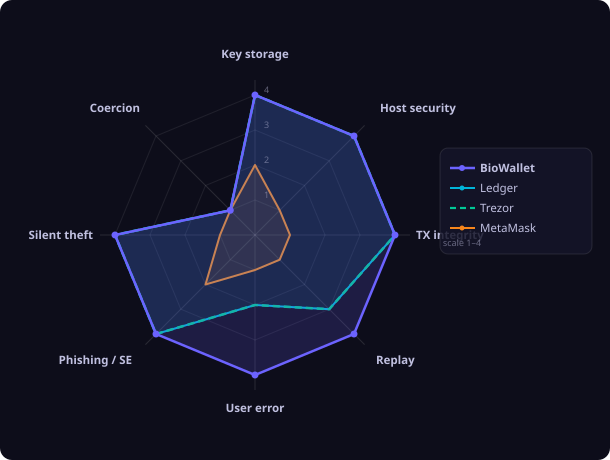

<p align="center">
  <h1 align="center">BioWallet</h1>
  <p align="center"><strong>Az arcod a kulcs. A titkod nem hagyja el az eszközödet.</strong></p>
  <p align="center">
    <a href="https://biowallet.metaspace.bio">Élő demo</a> ·
    <a href="README.md">English</a> ·
    <a href="SECURITY.md">Biztonsági szabályzat</a> ·
    <a href="docs/architecture.md">Architektúra</a> ·
    <a href="docs/formal-verification.md">Formális verifikáció</a>
  </p>
</p>

<p align="center">
  <a href="https://biowallet.metaspace.bio"></a>
  <a href="LICENSE"></a>
  <a href="tests/verify_biowallet.py"></a>
  <a href="tests/verify_sss_gf256.py"></a>
  
</p>

---

A BioWallet egy önszuverén, biometrikus Ethereum-tárca, amely teljes egészében a böngészőben fut. Nincs szerver, amely érintkezik a kulcsoddal, nincs létrehozandó fiók, nincs elfelejtendő jelszó. Az arcodat beolvasva a titkosítókulcs helyi szinten keletkezik — és minden egyes művelet után automatikusan törlődik.

**Több EVM-lánc:** Ethereum, BNB Chain, Polygon, Arbitrum, Base, Optimism, Avalanche, Sepolia — és bármely egyéni EVM-hálózat.

---

## Biztonság — bizonyítva, nem csak állítva

A legtöbb tárca azt mondja: bízz bennünk. A BioWallet megmutatja a bizonyítékot.

| Állítás | Mechanizmus | Bizonyíték |
|---|---|---|
| A privát kulcs nem érinti a main thredet | Web Worker izoláció — minden aláírás a `vault_worker.js`-ben történik | [src/app/vault_worker.js](src/app/vault_worker.js) |
| Az arc-adat visszafejthetetlen a kulcshoz | BCH(255,55,t=25) fuzzy extractor + HKDF — egyirányú deriválás | [src/core/fuzzy_extractor.js](src/core/fuzzy_extractor.js) |
| A vault kulcsa minden művelet után törlődik | DCC auto-lock: `SIGN → LOCK` azonos kauzális láncban | [DCC-4 formális bizonyíték](tests/verify_biowallet.py) |
| Vault nem nyílik meg friss biometrikus token nélkül | Token TTL = 30 s, egyszer használatos, Z3-mal verifikált | [DCC-1, DCC-2](tests/verify_biowallet.py) |
| Más eszközről csak arc + PIN-nel nyitható | v3 vault: `PBKDF2(face_R ‖ PIN, salt, 300k)` — helytelen PIN helytelen kulcsot ad, megkülönböztethetetlen a rossz arctól | [src/core/vault.js](src/core/vault.js) |
| Regisztrált eszközön PIN nélkül nyitható | WebAuthn PRF: `HKDF(face_R ‖ device_prf, salt)` — az eszközfaktor kiegészítő, nem helyettesíti a biometriát | [src/core/vault.js](src/core/vault.js) |
| Shamir GF(2⁸) aritmetika bizonyítottan helyes | Z3 BitVec, 196 608 kimerítő eset verifikálva | [tests/verify_sss_gf256.py](tests/verify_sss_gf256.py) |
| Futásidőben nem töltődik le külső kód | Minden vendor bundlolva, SHA-256 build-ujjlenyomat, SRI integrity attribútumok | [src/vendor/](src/vendor/) |
| Offline visszaállítás a seed phrase feltárása nélkül | Kétlépéses papírképlet — a P-érték soha nem kerül az alkalmazásba | [recovery\_tool.html](recovery_tool.html) |
| DCC alkotmány tamper-evident | `spec/biowallet.bio` SHA-256 lenyomata Arbitrum One blokkláncon rögzítve | [CONSTITUTION.md](CONSTITUTION.md) |

### Formális verifikáció eredménye

```
$ python tests/verify_biowallet.py

DCC-1   PASS  vault_open → token_fresh
DCC-2   PASS  ¬(token_consumed ∧ vault_open_again)
DCC-3   PASS  vault_open → causal_chain_valid
DCC-4   PASS  sign → next_state = LOCKED
DCC-5   PASS  nincs token-újrafelhasználás munkamenetek között
DCC-6   PASS  vault_state ∈ {LOCKED, OPEN, SIGNING}
DCC-7   PASS  bio_mismatch → marad zárolt
...
ALKOT-1  PASS  enrolled_factors ≥ 2 → enrollment_complete
ALKOT-6  PASS  csak arc ∧ ¬ujjlenyomat ∧ ¬hw_key → ¬vault_open_p10

Eredmény: 51 / 51  PASS ✓

$ python tests/verify_sss_gf256.py

GF-1   PASS  a ⊕ a = 0  (additív inverz)
GF-2   PASS  a · 1 = a  (multiplikatív egység)
GF-3   PASS  a · b = b · a  (kommutativitás)
GF-4   PASS  a · (b · c) = (a · b) · c  (asszociativitás)
GF-5   PASS  disztributív törvény
GF-6   PASS  a ≠ 0 → a · a⁻¹ = 1  (multiplikatív inverz)
SSS-1  PASS  reconstruct(split(titok, 2, 3)[0..1]) = titok
SSS-2  PASS  reconstruct(split(titok, 2, 3)[0,2]) = titok
SSS-3  PASS  reconstruct(split(titok, 2, 3)[1,2]) = titok
SSS-4  PASS  egyetlen share nem árul el információt a titokról
EXH-1  PASS  196 608 kimerítő GF(2⁸) szorzásos eset
EXH-2  PASS  256 kimerítő inverz-eset
EXH-3  PASS  256 kimerítő Lagrange-interpolációs eset

Eredmény: 13 / 13  PASS ✓
```

---

## Versenytárs-összehasonlítás

BioWallet, Ledger, Trezor és MetaMask értékelése 8 fenyegetési kategóriában (skála 1–4):

<p align="center">
  
</p>

Teljes elemzés adattáblával és oszlopdiagramokkal: [Magyar](docs/security_comparison_hu.html) · [English](docs/security_comparison_en.html)

---

## Hogyan működik

```
┌─────────────────────────────────────────────────────────────────┐
│  Böngésző main thread                                           │
│                                                                 │
│  arc-scan  ──►  Float32Array embedding                          │
│                         │                                       │
│           postMessage() │  (embedding nem tárolódik)           │
│                         ▼                                       │
│  ┌──────────────────────────────────────────────────────────┐   │
│  │  vault_worker.js  (izolált Worker szál)                  │   │
│  │                                                          │   │
│  │  embedding ──► BCH fuzzy extractor ──► vault_key         │   │
│  │  vault_key ──► AES-256-GCM decrypt ──► BIP39 seed        │   │
│  │  seed      ──► m/44'/60'/0'/0/0    ──► privát kulcs      │   │
│  │  privát kulcs ──► TX aláírás       ──► aláírt bájtok     │   │
│  │  DCC auto-lock: privát kulcs azonnali törlése után       │   │
│  └─────────────────────────────┬────────────────────────────┘   │
│                                │ csak aláírt bájtok             │
│                postMessage() ◄─┘                               │
│                         │                                       │
│  aláírt TX  ──►  JSON-RPC  ──►  EVM csomópont (publikus)       │
└─────────────────────────────────────────────────────────────────┘
```

**Kulcsinvariáns:** a privát kulcs a Workeren belül keletkezik, kerül felhasználásra és törlődik — soha nem jelenik meg a main threadben, a DOM-ban, illetve a BioWallet infrastruktúrájához intézett hálózati kérésben (ilyen infrastruktúra egyébként nem létezik).

---

## Funkciók

| Fázis | Funkció |
|---|---|
| Fázis 1–3 | FaceNet biometria, BCH fuzzy extractor, BIP39/BIP44 HD-tárca |
| Fázis 4–5 | AES-256-GCM vault, EIP-1559 díjbecslés, ETH-küldés |
| Fázis 6 | DCC (Digital Causal Closure) auto-lock protokoll |
| Fázis 9.0 | Kétlépéses papír-visszaállítás — a P-érték soha nem tárolódik digitálisan |
| Fázis 9.1 | PWA / offline támogatás, SHA-256 build-ujjlenyomat |
| C1 | QR-kód a fogadócímhez |
| C2 | ERC-20 egyenlegek és utalások (USDC, USDT, WETH és társaik) |
| C3 | ENS-feloldás (name.eth → 0x…) |
| C5 | Brute-force cooldown (3 eltérés → exponenciális várakozás) |
| C6 | WalletConnect v2 — dApp-munkamenetek, `eth_sendTransaction`, `personal_sign`, `wallet_switchEthereumChain` |
| C7 | Tranzakciótörténet a Blockscout API v2-n keresztül |
| v13 | Több hálózat: 8 beépített EVM-lánc + egyéni hálózat-hozzáadás |
| v22 | Kétnyelvű felület (HU / EN) — nyelvváltó gomb a fejlécben |
| v23 | P6 TX Commitment Invariant — 8 karakteres ujjlenyomat kötve a tranzakció hash-éhez; a második scanelés előtt a felhasználónak be kell gépelni az első 4 karaktert |
| v25 | WebAuthn PRF eszközfaktor — platformhitelesítő (ujjlenyomat / Face ID) regisztrálható eszközönként; regisztrált eszközön PIN nélkül nyitja a vaultot |
| v26 | PIN kötelező 2FA — v3 vault: `PBKDF2(face_R ‖ PIN, salt, 300k)`; új/nem regisztrált eszközön a PIN kötelező; eszközös útvonal mindig PIN nélküli |
| v27 | Mobil kamera kompatibilitás (Samsung ideal constraints, Firefox file picker fix, WebAuthn 60 s timeout) |
| v28 | Névadásos mentési modal (`showSaveFilePicker`), tudományos háttér docs (EN + HU), SW cache v12 |
| v29 | DCC alkotmány on-chain anchor (Arbitrum One), SRI integrity a vendor JS-eken, CSP fejlécek, Non-Commercial licenc, PWA auto-update banner |

---

## Architektúra

A teljes technikai leírást — köztük a vault-formátumot, a DCC-állapotgépet és a Worker-üzenetprotokollt — lásd a [docs/architecture.md](docs/architecture.md) fájlban.

---

## Kriptográfia

A teljes kriptográfiai specifikációt lásd a [docs/cryptography.md](docs/cryptography.md) fájlban:
- BCH(255,55,t=25) fuzzy extractor HKDF-SHA-256-tal
- AES-256-GCM vault-titkosítás (vault formátum p3)
- BIP39 mnemonik → BIP44 HD-kulcsderiválás
- Shamir-féle titkos megosztás GF(2⁸) felett (10. fázis)
- DCC kauzális token protokoll

---

## Önálló üzemeltetés

A BioWallet statikus oldal — nincs szükség backendre.

```bash
# Klónozás
git clone https://github.com/LemonScripter/biowallet.git
cd biowallet

# Kiszolgálás a src/ könyvtárból
cd src && python3 -m http.server 8080

# Vagy nginx-szel — lásd a docs/architecture.md fájlt az ajánlott
# Content-Security-Policy fejlécekhez.
```

**Követelmények:** HTTPS (a WebCrypto API és a kamera hozzáférés megköveteli), modern böngésző (Chrome 90+, Firefox 88+, Safari 15+).

---

## A formális verifikáció futtatása

```bash
pip install z3-solver
python tests/verify_biowallet.py
python tests/verify_sss_gf256.py
```

Mindkét szkript önálló, és minden egyes tulajdonsághoz emberi olvasásra alkalmas PASS/FAIL kimenetet ad.

---

## Tervezett fejlesztések

- [ ] **Argon2id KDF** — PBKDF2 lecserélése memóriaigényes KDF-re (vault formátum v4)
- [ ] **Több fiók** — BIP44 `m/44'/60'/0'/0/n`, több cím
- [ ] **10. fázis: SSS(2,3)** — arc + WebAuthn + papír, bármely kettő elegendő
- [ ] **Egyetlen fájlos build** — air-gapped `biowallet.html` (~11 MB, minden eszköz beágyazva)
- [ ] **Protokolldíj** — opcionális 0,1%-os fejlesztői díj a közvetlen utalásoknál

---

## Licenc

MIT + Commons Clause (Non-Commercial) © 2025–2026 Szőke László-Ferenc — [MetaSpace.Bio Logic Engine](https://metaspace.bio) | admin@metaspace.bio

A BioWallet nyílt forráskódú. Személyes és kutatási célra szabadon auditálható, forkizálható és önállóan üzemeltethető. Kereskedelmi felhasználáshoz írásos engedély szükséges. Ha biztonsági problémát találsz, kérjük, először olvasd el a [SECURITY.md](SECURITY.md) fájlt, mielőtt nyilvánosságra hoznád.
